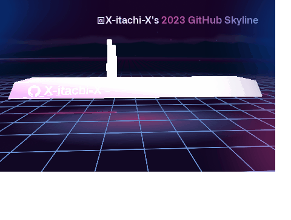

# 💫 About Me: 

<!--🔭I'm currently working on Mobile Applications  🫂I'm looking to collaborate on Open Source Projects 🌱I'm currently learning about React Native ☕Ask me about Coffee and Snacks 💡Fun fact: I am an Engineer too -->

 

 
<!--📏LINE-->

# 💻 Tech Stack: 
                        	    

# 📊 GitHub Stats: 
 

 
 

##  GitHub Trophies 

### ✍️ Random Dev Quote

### 🔝 Top Contributed Repo

<!--📏LINE-->

<!--😂💬JOKETITLE / 🌐WEBSITE: https://textanim.com/ -->

<!--🤣JOYEMOJI / 🌐WEBSITE: https://github.com/seanprashad/slackmoji/ -->

<!--💬🃏QUOTESCARD / 🌐WEBSITE: https://github.com/PiyushSuthar/github-readme-quotes#Demo & https://github.com/shravan20/github-readme-quotes -->
                                              
<!--🃏MEMEPHOTOS / 🌐WEBSITE: https://github.com/trinib/random-memer -->

<!--📏LINE-->

  
 

---

<!--📏LINE-->

 
## 🌐 Socials: 
  
 
<!--📏LINE-->

 
<!--🎨THEMEMODE / 🌐WEBSITE: https://fancytext.blogspot.com/ -->
<h4 align="left">
</h4>
 
╔═&nbsp;&nbsp;👀 𝕐&nbsp;𝕆&nbsp;𝕌&nbsp;ℝ&nbsp;&nbsp;𝕋&nbsp;ℍ&nbsp;𝔼&nbsp;𝕄&nbsp;𝔼&nbsp;&nbsp;𝕄&nbsp;𝕆&nbsp;𝔻&nbsp;𝔼 👀
<h4>
<h4 align="left">  
 
╚═════ &nbsp;𝐈𝐓'𝐒 [𝐃𝐀𝐑𝐊⚫](https://github.com/settings/appearance#gh-dark-mode-only)[𝐁𝐑𝐈𝐆𝐇𝐓⚪](https://github.com/settings/appearance#gh-light-mode-only) 𝐈𝐍 𝐇𝐄𝐑𝐄...
<h4>

<!--🪳ROACH&🕷️SPIDER--> 

&nbsp;&nbsp;&nbsp;&nbsp;&nbsp;&nbsp;&nbsp;&nbsp;&nbsp;&nbsp;&nbsp;&nbsp;&nbsp;&nbsp;&nbsp;&nbsp;&nbsp;&nbsp;&nbsp;&nbsp;&nbsp;&nbsp;&nbsp;&nbsp;&nbsp;&nbsp;&nbsp;&nbsp;&nbsp;&nbsp;&nbsp;&nbsp;&nbsp;&nbsp;&nbsp;&nbsp;&nbsp;&nbsp;&nbsp;&nbsp;&nbsp;&nbsp;&nbsp;&nbsp;&nbsp;&nbsp;&nbsp;&nbsp;&nbsp;&nbsp;&nbsp;&nbsp;&nbsp;&nbsp;&nbsp;&nbsp;&nbsp;&nbsp;&nbsp;&nbsp;&nbsp;&nbsp;&nbsp;&nbsp;&nbsp;&nbsp;&nbsp;&nbsp;&nbsp;&nbsp;&nbsp;&nbsp;&nbsp;&nbsp;&nbsp;&nbsp;&nbsp;&nbsp;&nbsp;&nbsp;&nbsp;&nbsp;&nbsp;&nbsp;&nbsp;&nbsp;&nbsp;&nbsp;&nbsp;&nbsp;&nbsp;&nbsp;&nbsp;&nbsp;&nbsp;&nbsp;&nbsp;&nbsp;&nbsp;&nbsp;&nbsp;&nbsp;&nbsp;&nbsp;&nbsp;&nbsp;&nbsp;&nbsp;&nbsp;&nbsp;&nbsp;&nbsp;
 
<!--🦶FOOTER--> 

 
 
