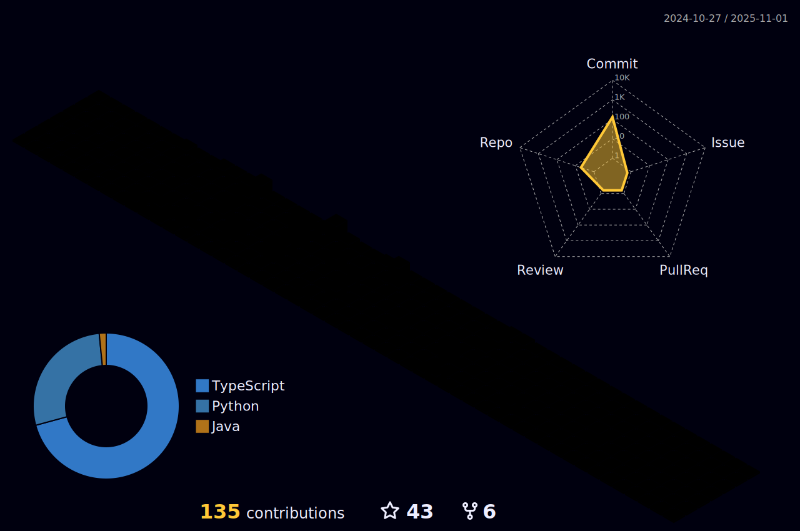

<!--ANDI BANDI SANDI JO CODE CHORI KRE USKI ---------->
<!-- header anime -->

<table>
 <tr>
  <td width="30%"></td>
  <td align="center"> </td>
  <td width="30%"></td>
 </tr>
</table>
<table>
 <tr>
  <td>  </td>
  <td>  </td>
  <td>  </td>
  <td>  </td>
  <td>  </td>
 </tr>
 </table>

<!--🔭I'm currently working on Mobile Applications  🫂I'm looking to collaborate on Open Source Projects 🌱I'm currently learning about React Native ☕Ask me about Coffee and Snacks 💡Fun fact: I am an Engineer too -->
<!-- About Me-->
</img>
</img> 
</img>
</img>
<!-- 
Watch This Moon Live > > > > > 
-->
</img>
</img>
</img>
</img>
</img>
</img>           

<table><tr><td align="center"></img></td></tr></table>

<!--📏LINE-->

<!-- Tech Stack-->

<h1 align="center"> 🗽 My Tech Stacks 🗽 </h1>
  

<table align="center" >
  <tr>
   <th width="30%"><h2> 📋 Languages </h2></th>
   <th width="30%"><h2> 📚 Frameworks, Platforms and Libraries </h2></th>
   <th width="30%"><h2> 🎨 Design </h2></th>
   
 </tr>
  <tr>
   <td>
    
    
    
    
    
    
    
    
    
    
    
    
    
    
    
    
    
    
    
   
   
   
   </td>
   
   <td>
       
       
       
       
       
       
       
       
       
       
       
       
       
       
       
       
       

    
   
   </td>
   
   <td>
       
       
       
       
       
       
       

   
   </td>
 </tr>
   <tr>
   <th><h2> 🕓 Version Control </h2></th>
   <th><h2> 💻 IDEs/Editors </h2></th>
   <th><h2> 💾 DataBase </h2></th>
 </tr>
  <tr>
   <td>
       
       
       
       
       
       
   
   </td>
   <td>
       
       
       
       
       
       
       
       
       
       
       
       
       
       
       

   
   </td>
   <td> 
       
       
       
       
       
       
       
   </td>
 </tr>
   <tr>
   <th><h2> 📱 Mobile Frameworks </h2></th>
   <th><h2> 🎛️ Operating System </h2></th>
   <th><h2> 🏢 Office </h2></th>
 </tr>
  <tr>
   <td> 
    
    
    
    
    

   </td>
   <td>
    
    
    
    
    
    
    
    
    
    
    
    
    
    
    
    
    
    
    
    
    
    
   </td>
   <td> 
    
    
    
    
    
   
   </td>
 </tr>
 
   <tr>
   <th><h2> ☁️ Hosting/SaaS </h2></th>
   <th><h2> 📂 Cloud Storage </h2></th>
   <th><h2> 🌐 Browsers </h2> </th> 
 </tr>
  <tr>
   <td>
     
     
     
     
     
     
     
     
     
     
     
   </td>
   <td>
    
    
    
    
   
   </td>
   <td>
    
    
    
    
    
   
   </td>
 </tr>
 
 <tr>
   <th><h2> 🖥️ ML/DL </h2></th>
   <th><h2> 🧪 Testing </h2></th>
   <th><h2> 🛍️ Store </h2> </th> 
 </tr>
 
  <tr>
   <td>
    
    
    
    
    
    
   </td>
   <td>
    
    
    
    
    
    
    
   
   </td>
   <td>
    
    
    
    
   
   </td>
 </tr>
 
  <tr>
   <th><h2> 📺 Streaming </h2></th>
   <th><h2> 🎮 Gaming </h2></th>
   <th><h2> 🎓 Education </h2> </th> 
 </tr>
 
  <tr>
   <td>
    
    
    
    
    
    
    
   </td>
   <td>
    
    
    
    
    
    
    
    
    

    
   
   </td>
   <td>
    
    
    
    
    
    
    
    
   
   </td>
 </tr>
</table>
 
<!-- Line -->

<!-- Github stats-->
<h1 align="center">
     GitHub Stats     
 </h1>

  

<table>
 <tr>
  <td> </td>
  <td> </td>
 </tr>
  <tr>
  <td> </td>
  <td> </td>
 </tr>
 </table
  
 
 <picture>
   <source media="(prefers-color-scheme: dark)" srcset="github-contribution-grid-snake-dark.svg" />
   <source media="(prefers-color-scheme: light)" srcset="github-contribution-grid-snake.svg" />
   
 </picture>
 

 <!-- Github Trophies-->
 <h1 align="center">
      GitHub Trophies     
 </h1>

 

 <h2> ✍️ Random Dev Quote ✍️ </h2>

 <h2> 🔝 Top Contributed Repo 🔝 </h2>

 

<!--📏LINE-->

 
<!--Music-->
<h1 align="center">🎧 Music 🎧</h1>

<!--📏LINE-->

 
<h1 align="center">
 
  Social 
 
</h1>
 

  
 
<!--📏LINE-->

 
<!--🎨THEMEMODE / 🌐WEBSITE: https://fancytext.blogspot.com/ -->
<h4 align="left">
</h4>
 
╔═&nbsp;&nbsp;👀 𝕐&nbsp;𝕆&nbsp;𝕌&nbsp;ℝ&nbsp;&nbsp;𝕋&nbsp;ℍ&nbsp;𝔼&nbsp;𝕄&nbsp;𝔼&nbsp;&nbsp;𝕄&nbsp;𝕆&nbsp;𝔻&nbsp;𝔼 👀
<h4>
<h4 align="left">  
 
╚═════ &nbsp;𝐈𝐓'𝐒 [𝐃𝐀𝐑𝐊⚫](https://github.com/settings/appearance#gh-dark-mode-only)[𝐁𝐑𝐈𝐆𝐇𝐓⚪](https://github.com/settings/appearance#gh-light-mode-only) 𝐈𝐍 𝐇𝐄𝐑𝐄...
<h4>

<!--🪳ROACH&🕷️SPIDER--> 

&nbsp;&nbsp;&nbsp;&nbsp;&nbsp;&nbsp;&nbsp;&nbsp;&nbsp;&nbsp;&nbsp;&nbsp;&nbsp;&nbsp;&nbsp;&nbsp;&nbsp;&nbsp;&nbsp;&nbsp;&nbsp;&nbsp;&nbsp;&nbsp;&nbsp;&nbsp;&nbsp;&nbsp;&nbsp;&nbsp;&nbsp;&nbsp;&nbsp;&nbsp;&nbsp;&nbsp;&nbsp;&nbsp;&nbsp;&nbsp;&nbsp;&nbsp;&nbsp;&nbsp;&nbsp;&nbsp;&nbsp;&nbsp;&nbsp;&nbsp;&nbsp;&nbsp;&nbsp;&nbsp;&nbsp;&nbsp;&nbsp;&nbsp;&nbsp;&nbsp;&nbsp;&nbsp;&nbsp;&nbsp;&nbsp;&nbsp;&nbsp;&nbsp;&nbsp;&nbsp;&nbsp;&nbsp;&nbsp;&nbsp;&nbsp;&nbsp;&nbsp;&nbsp;&nbsp;&nbsp;&nbsp;&nbsp;&nbsp;&nbsp;&nbsp;&nbsp;&nbsp;&nbsp;&nbsp;&nbsp;&nbsp;&nbsp;&nbsp;&nbsp;&nbsp;&nbsp;&nbsp;&nbsp;&nbsp;&nbsp;&nbsp;&nbsp;&nbsp;&nbsp;&nbsp;&nbsp;&nbsp;&nbsp;&nbsp;&nbsp;&nbsp;&nbsp;
 
<!--🦶FOOTER--> 

 
 
 

